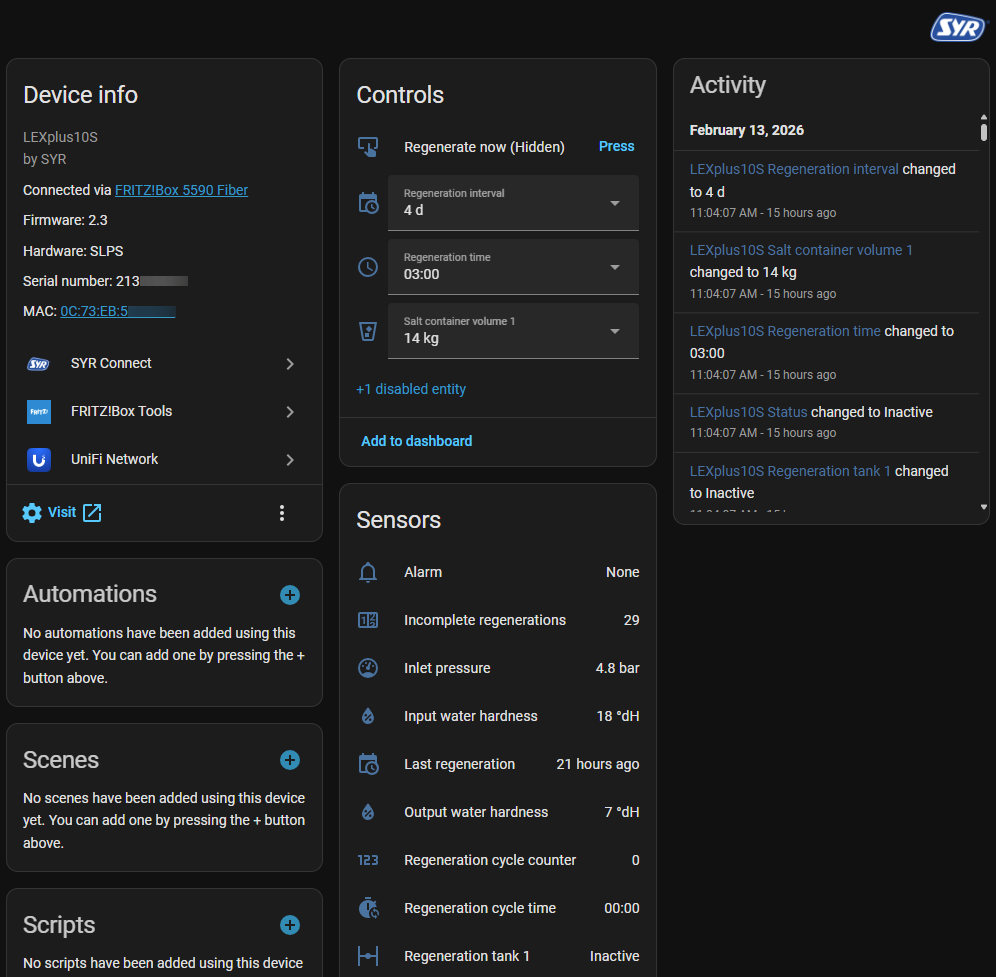
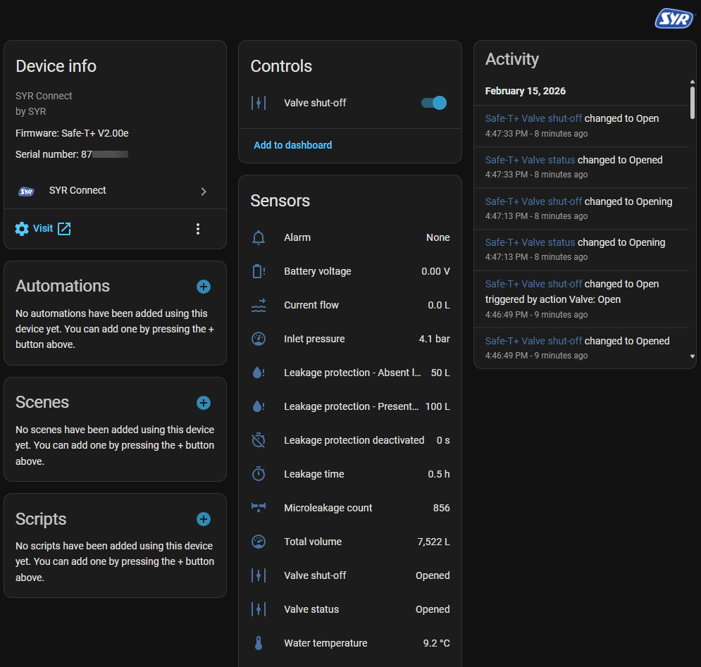

# SYR Connect – Home Assistant Integration

[](https://github.com/alexhass/syr_connect/releases)
[](https://my.home-assistant.io/redirect/config_flow_start/?domain=syr_connect)
[](https://github.com/alexhass/syr_connect/actions/workflows/hassfest.yaml)
[](https://github.com/alexhass/syr_connect/actions/workflows/hacs.yaml)
[](https://github.com/alexhass/syr_connect/actions/workflows/ci.yml)
[](https://codecov.io/gh/alexhass/syr_connect)

Diese Custom-Integration ermöglicht die Steuerung von SYR Connect-Geräten über Home Assistant.


## Screenshots

Beispiele der Geräteoberflächen:





## Haftungsausschluss

### WICHTIG: Bitte vor der Verwendung der Integration lesen

Diese Integration steuert Wasseraufbereitungssysteme und Absperrventile. Fehlerhafte Konfiguration oder fehlerhafte Automatisierungen können zu Wasserschäden, Systemausfällen oder Sachschäden führen.

- **Nutzung auf eigenes Risiko**: Diese Software wird „wie besehen" ohne jegliche Garantie bereitgestellt
- **Gründlich testen**: Teste Automatisierungen immer unter sicheren Bedingungen, bevor du sie produktiv einsetzt
- **Kritische Systeme**: Ventilsteuerungs-Automatisierungen können deine gesamte Wasserversorgung abschalten - teste sorgfältig
- **Keine Haftung**: Die Autoren und Mitwirkenden übernehmen keine Verantwortung für Schäden, Wasserschäden, Sachschäden oder andere Probleme, die aus der Nutzung dieser Integration entstehen
- **Cloud-Abhängigkeit**: Diese Integration ist auf den SYR Connect-Cloud-Dienst angewiesen - Verfügbarkeit ist nicht garantiert
- **Notfallplan**: Stelle sicher, dass du alternativen Zugang zu deinem Absperrventil hast, falls das System ausfällt

Durch die Installation und Nutzung dieser Integration erkennst du diese Risiken an und stimmst zu, sie verantwortungsbewusst zu verwenden.

## Installation

### Home Assistant Community Store - [HACS](https://hacs.xyz/) (empfohlen)

1. Öffne HACS in Home Assistant
2. Gehe zu „Integrationen“
3. Suche nach „SYR Connect“
4. Klicke auf „Installieren“
5. Starte Home Assistant neu

### Manuelle Installation

1. Kopiere den Ordner `syr_connect` in dein Verzeichnis `custom_components`
2. Starte Home Assistant neu

## Konfiguration

Die Integration unterstützt zwei Konfigurationsmodi:

### Cloud-API Einrichtung (Alle Geräte)

1. Gehe zu Einstellungen > Geräte & Dienste
2. Klicke auf "+ Integration hinzufügen"
3. Suche nach "SYR Connect"
4. Wähle "Cloud-Zugriff"
5. Gib deine SYR Connect App-Zugangsdaten ein:
   - **Benutzername**: Deine SYR Connect Konto-E-Mail
   - **Passwort**: Dein SYR Connect Konto-Passwort

### Lokale API Einrichtung (Nur neuere Geräte)

Für Geräte mit lokaler JSON-API-Unterstützung (NeoSoft 2500/5000 Connect, SafeTech Connect, TRIO DFR/LS Connect):

1. Gehe zu Einstellungen > Geräte & Dienste
2. Klicke auf "+ Integration hinzufügen"
3. Suche nach "SYR Connect"
4. Wähle "Lokaler-Zugriff"
5. Gib die Geräteinformationen ein:
   - **Gerätemodell**: Wähle dein Gerätemodell (NeoSoft 2500 Connect, NeoSoft 5000 Connect, SafeTech Connect oder TRIO DFR/LS Connect)
   - **Host**: IP-Adresse deines Geräts (z.B. `192.168.178.199`)
   - **Gerätename**: Benutzerdefinierter Name für das Gerät

**Hinweis**: Um die IP-Adresse deines Geräts zu finden, überprüfe die DHCP-Client-Liste deines Routers oder das Display-Menü des Geräts.

**Wichtig**: Für einen stabilen Betrieb muss das Gerät eine **statische IP-Adresse** oder eine **reservierte DHCP-Adresse** (DHCP-Reservierung) haben. Wenn sich die IP-Adresse des Geräts ändert, verliert die Integration die Verbindung und muss neu konfiguriert werden. Alternativ kannst du einen Hostnamen verwenden, wenn dein Netzwerk lokale DNS-Auflösung unterstützt.

## Funktionen

Die Integration erstellt automatisch Entitäten für alle SYR Connect Geräte in deinem Konto.

### Unterstützte Geräte

Diese Integration funktioniert mit SYR-Wasserenthärtern, Leckage-Erkennungsgeräte und anderen, die im SYR Connect-Cloud-Portal (über die SYR Connect App) sichtbar sind.

Getestet und gemeldet als funktionierend:

- SYR LEX Plus 10 Connect
- SYR LEX Plus 10 S Connect
- SYR LEX Plus 10 SL Connect
- SYR NeoSoft 2500 Connect
- SYR Safe-T+ Connect
- SYR TRIO DFR/LS Connect 2425

Nicht getestet, sollte aber funktionieren (bitte melden):

- SYR LEX 1500 Connect Einzel
- SYR LEX 1500 Connect Doppel
- SYR LEX 1500 Connect Pendel
- SYR LEX 1500 Connect Dreifach
- SYR IT 3000 Pendelanlage
- SYR NeoSoft 5000 Connect
- Andere SYR-Modelle mit Connect-Funktion oder nachgerüstetem Gateway

Andere Geräte sind auch interessant, können aber zusätzlichen Aufwand erfordern:

- HygBox Connect
- NeoDos Connect
- SafeTech Connect
- SafeTech plus Connect
- SafeFloor Connect

**Hinweis**: Wenn ein Gerät in deinem SYR Connect-Konto sichtbar ist, wird die Integration es automatisch entdecken und die Entitäten erstellen. Wenn du ein „ungetestetes Gerät“ besitzt, hilft es, diagnostische Daten zu teilen, damit unbekannte Werte analysiert und die Liste getesteter Geräte erweitert werden kann.

### Unterstützte Funktionen

#### Sensoren

Die Integration bietet umfangreiche Überwachung deines Wasserenthärters:

#### Wasserqualität & Kapazität

- Überwachung Ein-/Ausgangswasserhärte
- Verbleibende Kapazität
- Gesamtvolumen
- Anzeige der Einheit der Wasserhärte

#### Regenerationsinformationen

- Regenerationsstatus
- Anzahl durchgeführter Regenerationen
- Einstellung des Regenerationsintervalls
- Regenerationszeitplan

#### Salzverwaltung

- Salzmenge in Behältern (1–3)
- Salzvorrat
- Geschätzte Vorratsdauer

#### Systemüberwachung

- Wasserdruck
- Durchflussrate (aktuell)
- Durchflusszähler (Gesamtverbrauch)
- Alarmstatus

#### Geräteinformationen

- Seriennummer
- Firmware-Version und Modell
- Gerätetyp und Hersteller
- Netzwerk-Informationen (IP, MAC, Gateway)

#### Buttons (Aktionen)

- **Sofort regenerieren**: Sofortige Regeneration starten
- **Alarm zurücksetzen**: Aktive Alarmmeldungen löschen
- **Benachrichtigung zurücksetzen**: Benachrichtigungen löschen
- **Warnung zurücksetzen**: Warnungen löschen

#### Auswahlsteuerungen (Konfiguration)

- **Regenerationszeit**: Tägliche Regenerationszeit einstellen (15-Minuten-Intervalle)
- **Leckschutzprofil**: Aktives Leckschutzprofil auswählen (bei Geräten mit mehreren Profilen)
- **Salzmenge**: Salzmenge in Behältern konfigurieren (0-25 kg, je nach Modell; bis zu 3 Behälter)
- **Regenerationsintervall**: Regenerationshäufigkeit einstellen (1-4 Tage)

#### Ventilsteuerung

- **Absperrventil**: Steuerung des Haupt-Absperrventils
  - Ventil öffnen und schließen
  - Aktuelle Ventilposition und Status überwachen
  - Integration mit Leckerkennungs-Automatisierungen für automatisches Absperren

### Bekannte Einschränkungen

- **Cloud-Abhängigkeit**: Die Cloud-API benötigt eine aktive Internetverbindung und den funktionierenden SYR Connect-Cloud-Dienst
- **Update-Intervall**: Empfohlenes Minimum ist 60 Sekunden, um API-Rate-Limits bei der Cloud-API zu vermeiden
- **Eingeschränkter Schreibzugriff**: Konfigurationsänderungen (Regenerationszeit, Salzmengen, Intervalle) und Steuerungsaktionen (Regeneration, Ventilsteuerung) werden unterstützt, aber einige erweiterte Einstellungen sind möglicherweise nur über die SYR Connect App verfügbar
- **Lokale API-Unterstützung**: Nur einige neuere Gerätemodelle (NeoSoft 2500/5000 Connect, SafeTech Connect, TRIO DFR/LS Connect) bieten eine lokale JSON-API. Die meisten anderen Modelle, einschließlich aller LEXplus-Varianten, benötigen Cloud-API-Zugriff

### API-Modi

Die Integration unterstützt zwei API-Modi:

#### Cloud-API (XML-basiert)

- **Unterstützt von**: Allen SYR Connect-Geräten
- **Verbindung**: Über den SYR Connect-Cloud-Dienst (syrconnect.de)
- **Authentifizierung**: Benutzername und Passwort vom SYR Connect-Konto
- **Vorteile**: Funktioniert mit allen Gerätemodellen, Fernzugriff von überall
- **Voraussetzungen**: Internetverbindung, SYR Connect-Konto

#### Lokale API (JSON-basiert)

- **Unterstützt von**: Ausgewählte neuere Modelle mit integrierter lokaler API (NeoSoft 2500/5000 Connect, SafeTech Connect, TRIO DFR/LS Connect)
- **Verbindung**: Direkt zum Gerät über lokales Netzwerk (Port 5333)
- **Authentifizierung**: Keine Zugangsdaten erforderlich
- **Vorteile**: Keine Internetabhängigkeit, schnellere Reaktionszeiten, keine Cloud-Rate-Limits
- **Voraussetzungen**: Gerät muss im selben Netzwerk wie Home Assistant sein, Gerät benötigt statische IP-Adresse oder Hostnamen

Die Integration erkennt automatisch, welcher API-Modus basierend auf der bei der Einrichtung angegebenen Konfiguration zu verwenden ist.

## Wie Daten aktualisiert werden

Die Integration pollt die Geräte-API in regelmäßigen Abständen (Standard: 60 Sekunden). Der Aktualisierungsprozess hängt vom API-Modus ab:

### Cloud-API Aktualisierungsprozess

1. **Login**: Authentifiziert sich bei der SYR Connect-Cloud-API mit deinen Zugangsdaten
2. **Geräte-Erkennung**: Ruft alle Projekte und Geräte ab, die mit deinem Konto verknüpft sind
3. **Status-Updates**: Holt für jedes Gerät die aktuellen Statuswerte
4. **Entitäts-Updates**: Aktualisiert alle Home Assistant-Entitäten mit den neuesten Werten

### Lokale API Aktualisierungsprozess

1. **Status-Updates**: Holt den Gerätestatus direkt vom lokalen Endpunkt
2. **Entitäts-Updates**: Aktualisiert alle Home Assistant-Entitäten mit den neuesten Werten

Die lokale API ist schneller und benötigt keine Internetverbindung, was sie zuverlässiger für Echtzeit-Überwachung und Automatisierungen macht.

Wenn ein Gerät nicht verfügbar ist (z. B. offline), werden seine Entitäten bis zum nächsten erfolgreichen Update als nicht verfügbar markiert.

## Anwendungsbeispiele

### Automation Beispiele

#### Niedriger Salz-Alarm

Benachrichtigung, wenn der Salzvorrat niedrig ist:

```yaml
automation:
  - alias: "SYR: Low Salt Alert"
    trigger:
      - platform: numeric_state
        entity_id: sensor.syr_connect_<serial_number>_getss1
        below: 2  # Weniger als 2 Wochen Salzvorrat
    action:
      - service: notify.mobile_app
        data:
          title: "Water Softener Alert"
          message: "Salt supply low - less than 2 weeks remaining"
```

#### Täglicher Regenerationsbericht

```yaml
automation:
  - alias: "SYR: Daily Regeneration Report"
    trigger:
      - platform: time
        at: "20:00:00"
    action:
      - service: notify.mobile_app
        data:
          title: "Water Softener Daily Report"
          message: >
            Regenerations today: {{ states('sensor.syr_connect_<serial_number>_getnor') }}
            Remaining capacity: {{ states('sensor.syr_connect_<serial_number>_getres') }}L
            Salt supply: {{ states('sensor.syr_connect_<serial_number>_getss1') }} weeks
```

#### Alarm-Benachrichtigung

```yaml
automation:
  - alias: "SYR: Alarm Notification"
    trigger:
      - platform: template
        value_template: "{{ states('sensor.syr_connect_<serial_number>_getalm') != 'no_alarm' }}"
    action:
      - service: notify.mobile_app
        data:
          title: "⚠️ Water Softener Alarm"
          message: "Check your SYR device - alarm detected! Current alarm: {{ states('sensor.syr_connect_<serial_number>_getalm') }}"
          data:
            priority: high
```

#### Überwachung des Wasserflusses

```yaml
automation:
  - alias: "SYR: High Flow Alert"
    trigger:
      - platform: numeric_state
        entity_id: sensor.syr_connect_<serial_number>_getflo
        above: 20  # Durchflussrate über 20 L/min
        for:
          minutes: 5
    action:
      - service: notify.mobile_app
        data:
          title: "High Water Flow Detected"
          message: "Unusual water flow - check for leaks!"
```

#### Lecksensor — Absperrventil schließen

Schließt automatisch das Absperrventil, wenn ein Leckmelder einen Wasseraustritt meldet. Dieses Beispiel verwendet den Standard-Dienst `valve.close`, um das SYR-Absperrventil zu schließen. Ersetze die Entity-IDs durch die korrekten IDs in deinem System. Teste sehr sorgfältig, ob diese Automatisierung korrekt funktioniert, da sie zu einer kritischen Sicherheitsmaßnahme werden kann.

```yaml
automation:
  - alias: "SYR: Ventil bei Leck schließen"
    description: "SYR-Ventil auf geschlossen (setAB = true) setzen, wenn ein Leckmelder Wasser erkennt."
    trigger:
      - platform: state
        entity_id: binary_sensor.house_leak_sensor
        to: 'on'
    action:
      - service: valve.close
        target:
          entity_id: valve.syr_connect_<serial_number>_getab
      - service: notify.mobile_app
        data:
          title: "SYR: Leck erkannt — Ventil geschlossen"
          message: "Wasseraustritt erkannt — SYR-Absperrventil wurde automatisch geschlossen."
```

#### Geplante Regenerations-Überschreibung

```yaml
automation:
  - alias: "SYR: Weekend Regeneration"
    trigger:
      - platform: time
        at: "03:00:00"
    condition:
      - condition: time
        weekday:
          - sat
          - sun
    action:
      - service: button.press
        target:
          entity_id: button.syr_connect_<serial_number>_setsir
```

**Hinweis**: Ersetze `<serial_number>` durch die Seriennummer deines Geräts in allen Beispielen.

## Konfigurationsoptionen

### Scan-Intervall

Standardmäßig werden Daten alle 60 Sekunden aktualisiert. Du kannst dies in den Integrations-Optionen anpassen:

1. Gehe zu Einstellungen > Geräte & Dienste
2. Finde die SYR Connect Integration
3. Klicke auf „Konfigurieren"
4. Passe das Scan-Intervall (in Sekunden) an

## Deinstallation

So entfernst du die Integration aus Home Assistant:

1. Gehe zu Einstellungen > Geräte & Dienste
2. Finde die SYR Connect Integration
3. Klicke auf das Drei-Punkte-Menü (⋮)
4. Wähle „Löschen“
5. Bestätige die Löschung

Alle zugehörigen Geräte und Entitäten werden automatisch entfernt.

## Fehlerbehebung

### Diagnosedaten herunterladen

Wenn Probleme auftreten, kannst du Diagnosedaten herunterladen:

1. Gehe zu Einstellungen > Geräte & Dienste
2. Finde die SYR Connect Integration
3. Klicke auf das Gerät
4. Klicke auf das Drei-Punkte-Menü (⋮)
5. Wähle „Diagnosedaten herunterladen“

Die Datei enthält hilfreiche Informationen zur Fehlersuche (sensible Daten wie Passwörter werden automatisch entfernt).

### Verbindungsprobleme

- **Zugangsdaten prüfen**: Überprüfe Benutzername und Passwort für die SYR Connect App
- **App testen**: Melde dich in der SYR Connect App an, um zu prüfen, ob der Account funktioniert
- **Logs prüfen**: Gehe zu Einstellungen > System > Protokolle und suche nach Fehlern mit "syr_connect"
- **Netzwerk**: Stelle sicher, dass Home Assistant Internetzugang hat

### Authentifizierungsfehler

Wenn du "Authentication failed" siehst:

1. Überprüfe deine Zugangsdaten
2. Die Integration fordert zur erneuten Authentifizierung auf
3. Gehe zu Einstellungen > Geräte & Dienste
4. Klicke auf "Authentifizieren" bei der SYR Connect Integration
5. Gib deine Zugangsdaten erneut ein

### Keine Geräte gefunden

- **App-Einrichtung**: Stelle sicher, dass Geräte in der SYR Connect App richtig konfiguriert sind
- **Konto**: Verwende dasselbe Konto, das deine Geräte enthält
- **Gerätestatus**: Prüfe, ob Geräte in der SYR Connect App online sind
- **Logs**: Prüfe Home Assistant-Logs auf spezifische Fehlermeldungen

### Entitäten sind als nicht verfügbar markiert

- **Gerät offline**: Prüfe, ob das Gerät in der SYR Connect App online ist
- **Netzwerkprobleme**: Verifiziere die Internetverbindung
- **Cloud-Dienst**: Der SYR Connect-Cloud-Dienst könnte vorübergehend nicht verfügbar sein
- **Warte auf Update**: Entitäten werden nach dem nächsten erfolgreichen Update wieder verfügbar

### Hohe CPU-/Speicherauslastung

- **Scan-Intervall erhöhen**: Setze einen höheren Wert (z. B. 120–300 Sekunden) in den Integrations-Optionen

## Abhängigkeiten

Die Integration benötigt folgende Python-Pakete:

- `pycryptodomex==3.19.0`: Für AES-Verschlüsselung/-Entschlüsselung
- `defusedxml==0.7.1`: Für sichere XML-Verarbeitung (verhindert XXE-Angriffe)

**Hinweis**: Die Integration verwendet `defusedxml` für sichere XML-Verarbeitung und `pycryptodomex` (nicht `pycryptodome`), um Konflikte mit Home Assistants internen Kryptobibliotheken zu vermeiden.

Dieses Paket wird von Home Assistant automatisch installiert, wenn du:

1. Die Integration über die UI hinzufügst
2. Home Assistant nach der Installation neu startest

Für detaillierte Systemanforderungen siehe [REQUIREMENTS.md](REQUIREMENTS.md).

## Lizenz

MIT License - siehe LICENSE Datei

## Danksagungen

- [ioBroker.syrconnectapp](https://github.com/TA2k/ioBroker.syrconnectapp) von TA2k.
- Vielen Dank an das SYR IoT-Entwicklungsteam für das Bereitstellen der Logos.
