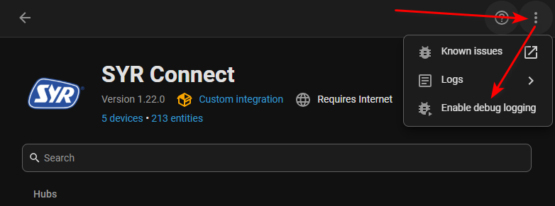
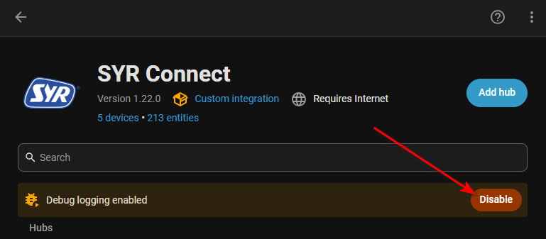

# SYR Connect integration - Enabling debugging in Home Assistant

This document explains how to enable and disable debug logging for the SYR Connect integration in Home Assistant. It covers two API types: the **XML API** (cloud) and the **JSON API** (local).

## Activate HA debugging

1. Enable debugging.
2. Reboot HA for clean and complete logs.
3. Reproduce the issue if needed.



## Disable HA debugging

1. Wait 5 minutes after the reboot.
2. Press the disable button.
3. Save the logfile to disk.



Important: Debug logs may contain sensitive data (API responses, encrypted payloads, credentials). Enable debugging only temporarily and review or redact logs before sharing.

---

## JSON API (local)

Some devices expose a local JSON API on port `5333`. The following `<BASE_PATH>` values are well-known. They are typically self-speaking to your device type.

- `/all-in-one/`
- `/dosing-pump/`
- `/floorsensor/`
- `/hygbox/`
- `/neosoft/`
- `/pontos-base/`
- `/safe-tec/`
- `/trio/`

### Test steps

1. Check ADM login (some devices require this; an HTTP 404 often indicates login is not required):

    ```bash
    curl -v -i http://<DEVICE_IP>:5333/<BASE_PATH>/set/ADM/(2)f -o <OUTPUT_FILE>
    # Example: curl -v -i http://192.168.178.20:5333/neosoft/set/ADM/(2)f -o json_response_neosoft_set_adm.txt
    ```

2. Request full status (`/get/all`) - the device should return a flat JSON object with `getXYZ` keys:

    ```bash
    curl -v -i http://<DEVICE_IP>:5333/<BASE_PATH>/get/all -o <OUTPUT_FILE>
    # Example: curl -v -i http://192.168.178.20:5333/neosoft/get/all -o json_response_neosoft_get_all.txt
    ```

    Note: Use `-v` for detailed output (headers, status code). Replace `<BASE_PATH>` with the path used by your device or integration (e.g. `/neosoft/`).

### Examples

```bash
# ADM login checks (run one per base_path) - replace <DEVICE_IP> and <OUTPUT_FILE>
curl -v -i http://<DEVICE_IP>:5333/all-in-one/set/ADM/(2)f -o <OUTPUT_FILE>
curl -v -i http://<DEVICE_IP>:5333/dosing-pump/set/ADM/(2)f -o <OUTPUT_FILE>
curl -v -i http://<DEVICE_IP>:5333/floorsensor/set/ADM/(2)f -o <OUTPUT_FILE>
curl -v -i http://<DEVICE_IP>:5333/hygbox/set/ADM/(2)f -o <OUTPUT_FILE>
curl -v -i http://<DEVICE_IP>:5333/neosoft/set/ADM/(2)f -o <OUTPUT_FILE>
curl -v -i http://<DEVICE_IP>:5333/pontos-base/set/ADM/(2)f -o <OUTPUT_FILE>
curl -v -i http://<DEVICE_IP>:5333/safe-tec/set/ADM/(2)f -o <OUTPUT_FILE>
curl -v -i http://<DEVICE_IP>:5333/trio/set/ADM/(2)f -o <OUTPUT_FILE>

# /get/all checks (expect flat JSON with get... keys) - replace <DEVICE_IP> and <OUTPUT_FILE>
curl -v -i http://<DEVICE_IP>:5333/all-in-one/get/all -o <OUTPUT_FILE>
curl -v -i http://<DEVICE_IP>:5333/dosing-pump/get/all -o <OUTPUT_FILE>
curl -v -i http://<DEVICE_IP>:5333/floorsensor/get/all -o <OUTPUT_FILE>
curl -v -i http://<DEVICE_IP>:5333/hygbox/get/all -o <OUTPUT_FILE>
curl -v -i http://<DEVICE_IP>:5333/neosoft/get/all -o <OUTPUT_FILE>
curl -v -i http://<DEVICE_IP>:5333/pontos-base/get/all -o <OUTPUT_FILE>
curl -v -i http://<DEVICE_IP>:5333/safe-tec/get/all -o <OUTPUT_FILE>
curl -v -i http://<DEVICE_IP>:5333/trio/get/all -o <OUTPUT_FILE>
```

Tip: If the `/set/ADM/(2)f` endpoint returns `404`, try `/get/all` directly - many devices do not require the ADM login endpoint.
